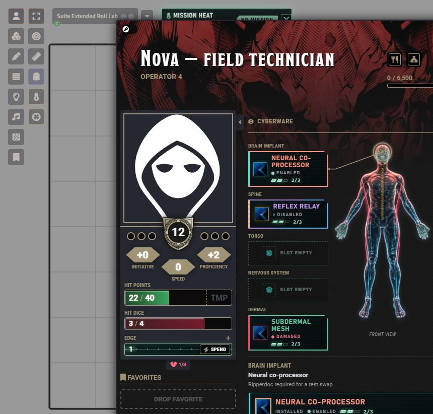

# Hardwipe Ruleset

**Cyberware, firefights, and a character sheet that feels like street tech.**

Hardwipe adapts D&D5e in Foundry for a Cyberpunk game: implants share your real inventory, walls become physical cover, and combat plays through software-inspired chat cards.

[Install](#install) · [Player guide](docs/Players.md) · [GM guide](docs/GM.md) · [Card gallery](docs/Cards.md) · [Rules reference](docs/Reference.md)

> **Release status:** the public installer is **0.7.40**, paired with Ready Set Midi **14.0.10.1**. Screenshots marked **audited preview** show the next tested source revision, including the compact wall editor and source-specific ranged hints. See [development status](docs/Development.md) before using unreleased source.

## Your body is your loadout



Ten body regions, real inventory items, visible charges, and clear implant states. Installed, working cyberware supplies its passive effects; active cyberware exposes its normal D&D5e activities beside your weapons. SC – Item Rarity Colors carries its configured colors into the slots.

[Set up cyberware →](docs/Cyberware.md) · [Choose a personal paper doll →](docs/Cyberware.md#personal-paper-dolls)

## Rest at the safehouse


Roll **one Hit Die at a time** inside the rest dialog. Watch HP recover, inspect each result, use eligible rest abilities, then send one combined receipt to chat. Queued implant swaps complete when the rest and service requirements are met.

[Take a rest →](docs/Rests.md) · [Static dialog capture](docs/media/rest-current.png)

## Roll, review, resolve

| Player attack | Private GM review |
| --- | --- |
|  |  |

The player sees the roll. The GM confirms the target outcomes. Damage and on-hit effects wait for that decision. Shield Block uses the normal reaction and records durability and damage through.

[Combat and shields →](docs/Combat.md) · [Edge, Strikes, and Downed →](docs/Players.md#edge-strikes-and-downed)

## Cover that changes the fight

| Configure a wall | Review an impact |
| --- | --- |
|  |  |

Walls supply ranged cover. Give them a type, HP, armor, and a damage threshold. Players can target a wall directly; the GM chooses **Apply damage** or **Ignore**. Cracks reveal light and vision before destruction opens a five-foot breach.

[Configure and fight around walls →](docs/Walls.md)

## Concentration is a running program

| Interrupt | Recovered | Crashed |
| --- | --- | --- |
|  |  |  |

A damage interrupt asks for a save. Success restores the program; failure displays a crash. Spells, implants, checks, gear, features, and rest receipts each have their own readable card language.

[Browse every card family →](docs/Cards.md) · [Concentration controls →](docs/Combat.md#concentration)

## Raise the Heat


A scene-level Heat meter tracks escalation. Pick **Threat broadcast**, **Corrupted feed**, or **Police scanner** for the mission, with three separate turn-start styles and configurable card colors. Motion respects reduced-motion preferences.

[Mission Heat and interface settings →](docs/GM.md#mission-heat)

## Install

Tested public release: **Foundry VTT 14.367 · D&D5e 6.0.5 · Ready Set Midi 14.0.10.1**.

1. In Foundry Setup, open **Add-on Modules → Install Module**.
2. Paste this manifest:

   ```text
   https://github.com/TobbyClay/hardwipe-ruleset/releases/latest/download/module.json
   ```

3. Install the matching **Ready Set Midi** fork and its dependencies. Enable Hardwipe Ruleset, Ready Set Midi, libWrapper, socketlib, and DAE.
4. Use the **Hardwipe Character** sheet. Disable standalone Midi-QOL and Ready Set Roll when using the fork.

[Downloads and release notes](https://github.com/TobbyClay/hardwipe-ruleset/releases/latest) · [Detailed setup and troubleshooting](docs/GM.md#installation-and-first-run) · [Report a problem](https://github.com/TobbyClay/hardwipe-ruleset/issues)

## Find the right guide

| I want to… | Open |
| --- | --- |
| Play a character, use actions, or understand Edge and Strikes | [Player guide](docs/Players.md) |
| Install or swap implants, use rarity colors, or change the doll | [Cyberware](docs/Cyberware.md) |
| Roll Hit Dice, recover slots, or understand a rest receipt | [Rests](docs/Rests.md) |
| Review attacks, use shields, roll saves, or maintain concentration | [Combat](docs/Combat.md) |
| Give walls HP, set thresholds, target sections, or undo a breach | [Walls](docs/Walls.md) |
| Configure a world, Mission Heat, colors, text, or folding | [GM guide](docs/GM.md) |
| Compare every visual card family | [Card gallery](docs/Cards.md) |
| Read exact cover rules, integration fields, or limitations | [Rules reference](docs/Reference.md) |

All images are actual Foundry captures from synthetic development scenes, with cropping or resizing for readability. Capture versions and preview distinctions are listed in the [media notes](docs/Media.md). They illustrate the interface; they are not a claim that every possible module combination has been tested.
