# Card gallery

[← Overview](../README.md) · [Combat](Combat.md) · [Rests](Rests.md) · [Cyberware](Cyberware.md) · [GM settings](GM.md)

Hardwipe gives each kind of action its own software-inspired display. Click any image to open the full capture. The examples use synthetic characters and scenes, so the QA names are demonstration data.

> **Release status:** the public installer is **0.7.40**. The 38 core examples below are native captures from **0.7.38**; later system examples are labeled **0.7.39** or **0.7.40**. Anything labeled **audited preview** comes from tested local source and does not imply a published 0.7.41 release. See [development status](Development.md) and [media provenance](Media.md).

[Weapons](#weapon-outcomes-and-gm-review) · [Spells](#spell-programs) · [Concentration](#concentration-interrupts) · [Checks](#checks-and-initiative) · [Gear](#gear-and-class-features) · [Implants](#cyberware-diagnostics) · [Rests](#short-rest-monitor) · [System cards](#edge-strikes-and-downed) · [Heat](#mission-heat-styles)

## Weapon outcomes and GM review

Use a weapon activity to make the roll; the GM confirms each target. The verdict, attack dice, damage breakdown, and apply controls share one card. [Combat and approval →](Combat.md)

*Native captures: 0.7.38.*

<table>
  <tr>
    <td valign="top"><a href="media/attack-hit.webp">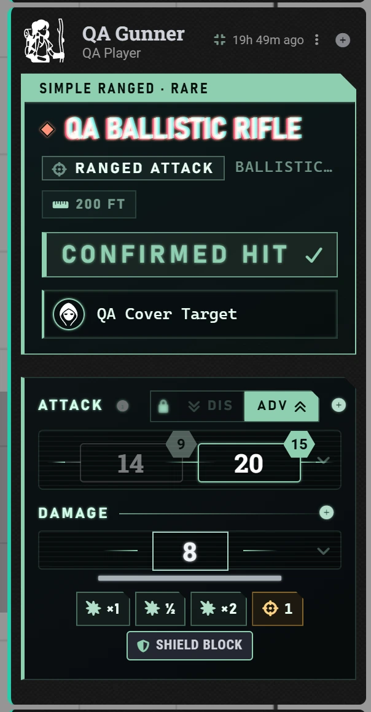</a> <strong>Confirmed hit</strong> The target verdict sits above the attack and damage totals.</td>
    <td valign="top"><a href="media/attack-crit.webp">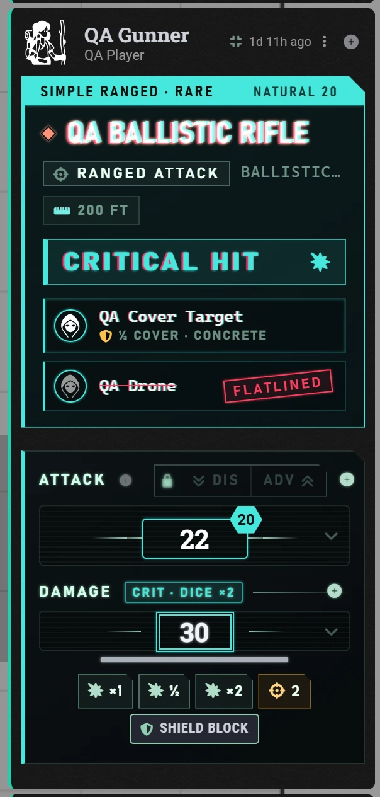</a> <strong>Critical hit</strong> Critical damage, cover, and target status remain visible together.</td>
    <td valign="top"><a href="media/attack-miss.webp">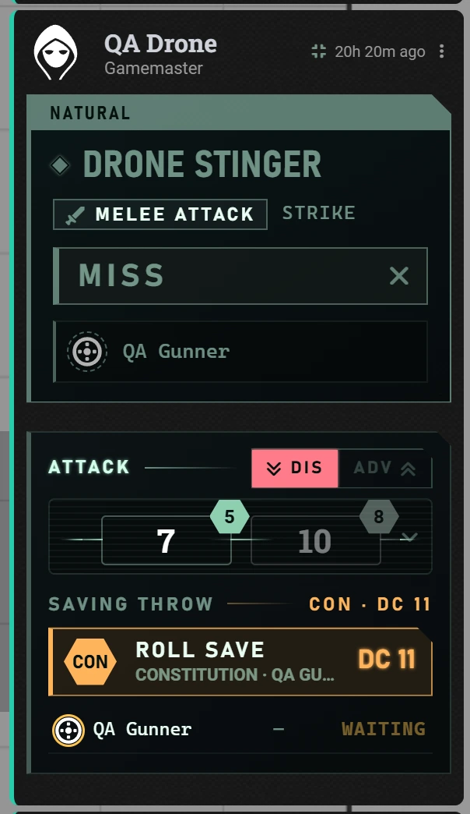</a> <strong>Miss</strong> A missed attack keeps its rolled result and any associated save controls.</td>
  </tr>
  <tr>
    <td valign="top"><a href="media/attack-fumble.webp">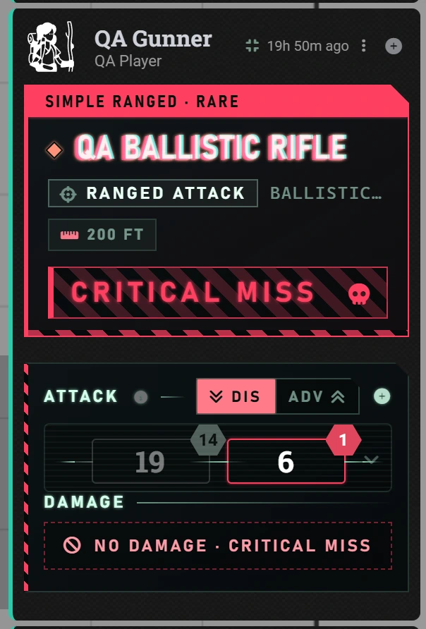</a> <strong>Critical miss</strong> A natural 1 is clearly marked after the GM decision.</td>
    <td valign="top"><a href="media/attack-review-gm.webp">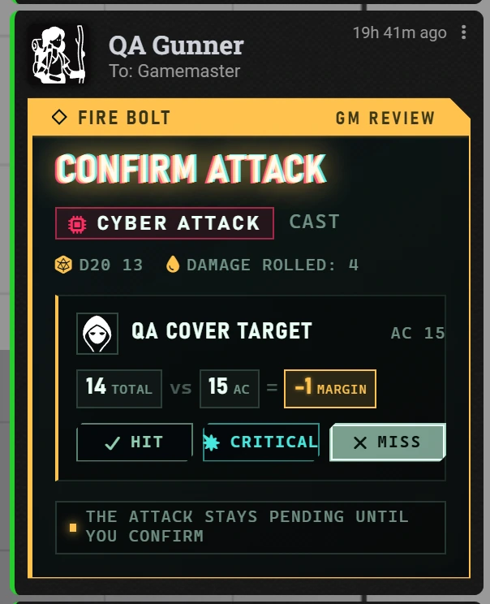</a> <strong>Private GM review</strong> Choose Hit, Critical, or Miss for each target; pending attacks wait for confirmation.</td>
  </tr>
</table>

## Spell programs

Spell activities appear as a running program. Read the output, open Info for the description, and resolve any requested saves. [Spells and saves →](Combat.md#saving-throws)

*Native captures: 0.7.38.*

<table>
  <tr>
    <td valign="top"><a href="media/spell-attack.webp">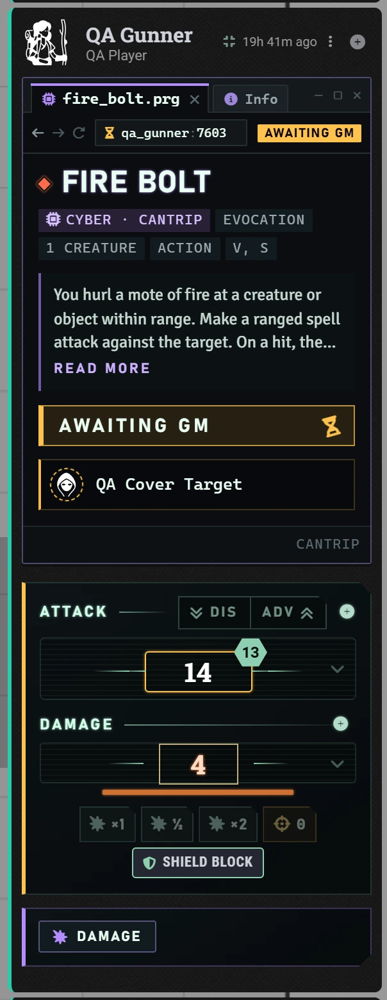</a> <strong>Awaiting GM</strong> A spell attack remains pending until the target outcome is confirmed.</td>
    <td valign="top"><a href="media/spell-hit.webp">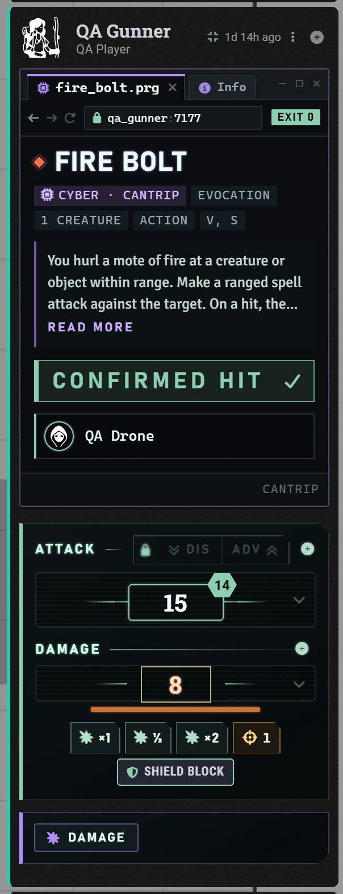</a> <strong>Confirmed spell attack</strong> The program displays its resolved attack and damage.</td>
  </tr>
  <tr>
    <td valign="top"><a href="media/spell-save.webp">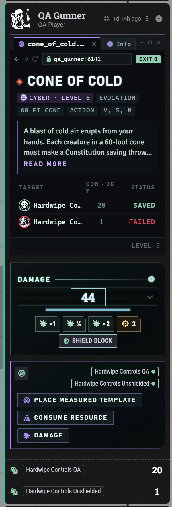</a> <strong>Saving-throw spell</strong> Each target has its own waiting, saved, or failed result.</td>
    <td valign="top"><a href="media/spell-heal.webp">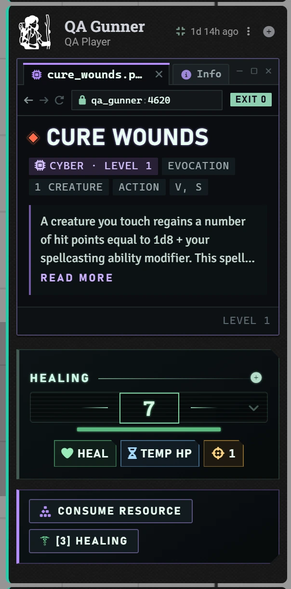</a> <strong>Healing program</strong> Healing keeps its roll and application controls in the spell window.</td>
  </tr>
</table>

## Concentration interrupts

Damage interrupts the held program and asks for a Constitution save. Roll from the request; its state changes with the result. These examples show the owner/GM view. [Concentration controls →](Combat.md#concentration)

*Native captures: 0.7.38.*

<table>
  <tr>
    <td valign="top"><a href="media/conc-interrupt.webp">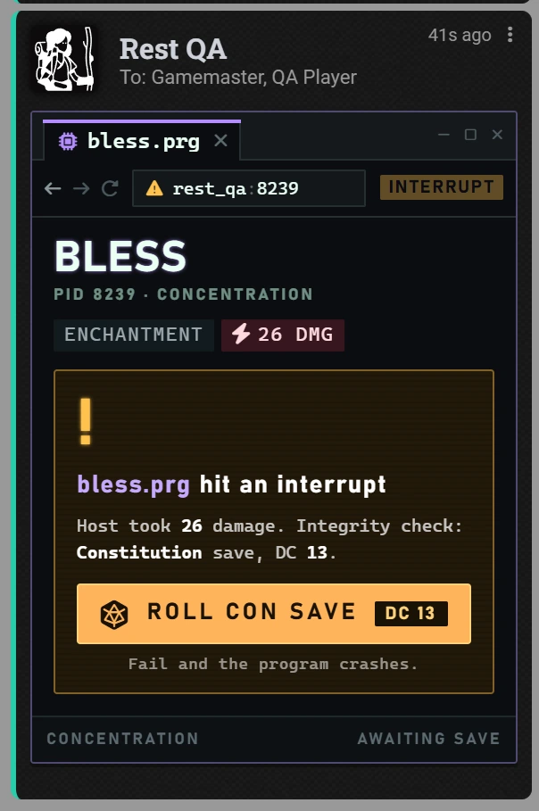</a> <strong>Interrupt received</strong> Roll CON save from the request using the normal roll dialog.</td>
    <td valign="top"><a href="media/conc-held.webp">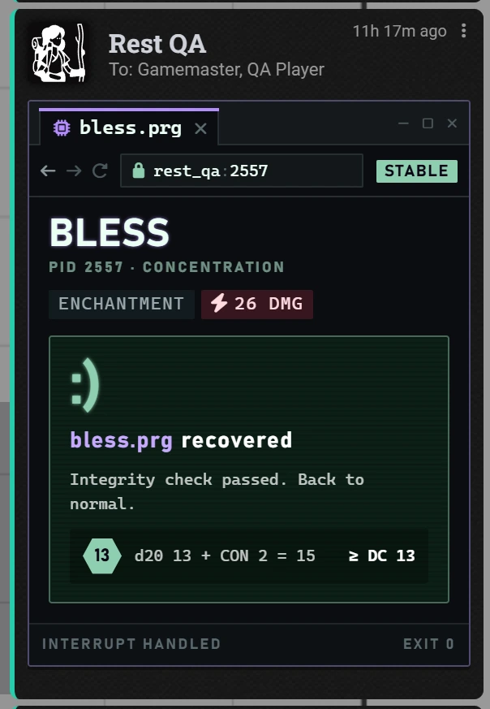</a> <strong>Recovered</strong> A successful save reports that the program is still running.</td>
    <td valign="top"><a href="media/conc-lost.webp">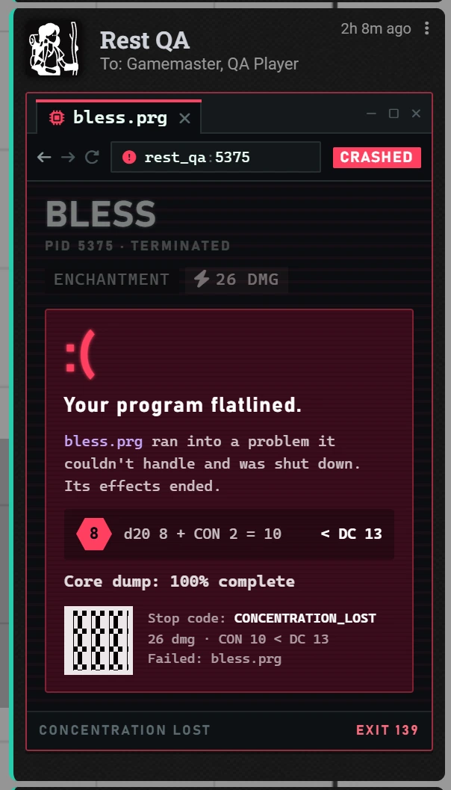</a> <strong>Program crashed</strong> A failed save displays the concentration loss.</td>
  </tr>
  <tr>
    <td valign="top"><a href="media/conc-offline.webp">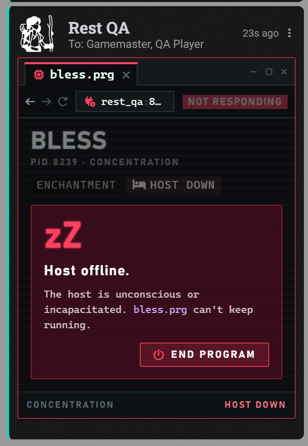</a> <strong>Host offline</strong> An incapacitated host offers End program.</td>
    <td valign="top"><a href="media/conc-ended.webp">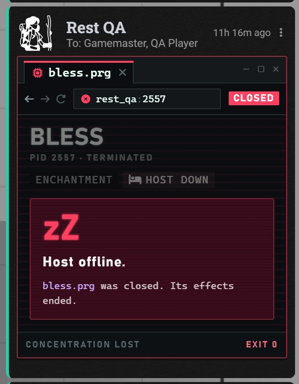</a> <strong>Program closed</strong> The ended state makes an intentional shutdown explicit.</td>
    <td valign="top"> <strong>Save folded into the record</strong> The linked save collapses to a compact result after resolution.</td>
  </tr>
</table>

## Checks and initiative

Skills, abilities, saves, initiative, and concentration saves share readable roll totals and natural-die badges. Open the total for the dice breakdown. [Roll controls →](Combat.md#read-and-apply-a-roll)

*Native captures: 0.7.38.*

<table>
  <tr>
    <td valign="top"><a href="media/check-skill.webp">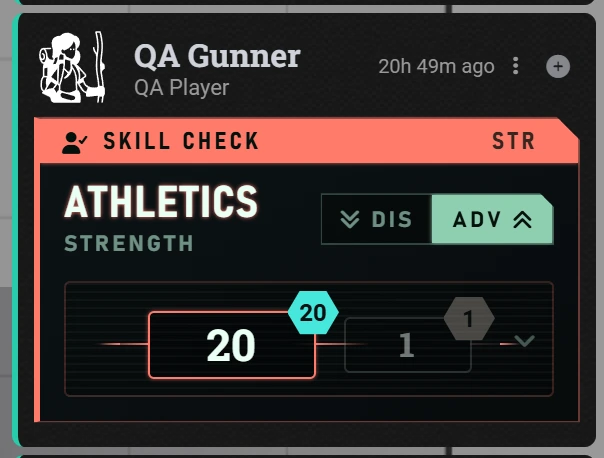</a> <strong>Skill check</strong> Advantage shows the kept and dropped dice.</td>
    <td valign="top"><a href="media/check-ability.webp">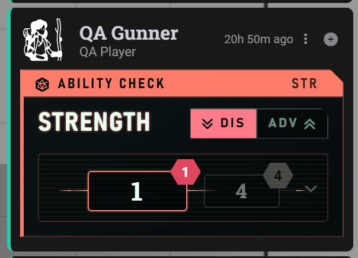</a> <strong>Ability check</strong> Disadvantage retains a visible account of the roll.</td>
    <td valign="top"><a href="media/check-save.webp">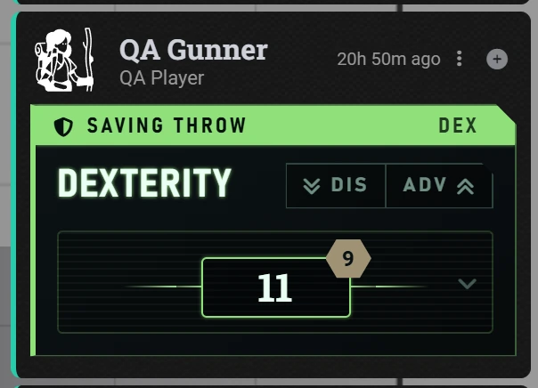</a> <strong>Saving throw</strong> The ability and total are easy to identify.</td>
  </tr>
  <tr>
    <td valign="top"><a href="media/check-initiative.webp">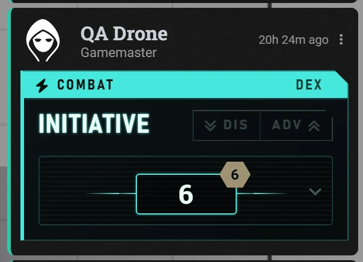</a> <strong>Initiative</strong> The initiative result uses the same roll language.</td>
    <td valign="top"><a href="media/check-concentration.webp">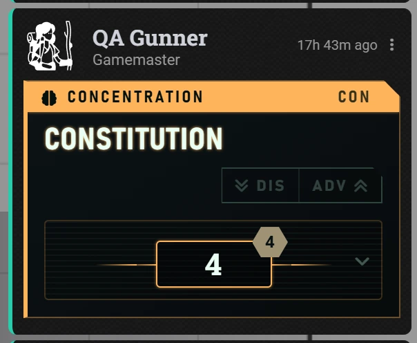</a> <strong>Concentration save</strong> The save card records the concentration outcome.</td>
  </tr>
</table>

## Gear and class features

Use the item or feature through its native activity. The card exposes uses, rolls, saves, or healing appropriate to that activity. [Player actions →](Players.md)

*Native captures: 0.7.38.*

<table>
  <tr>
    <td valign="top"><a href="media/item-potion.webp">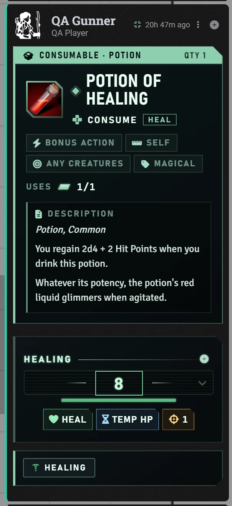</a> <strong>Potion of Healing</strong> The consumable card carries its healing roll.</td>
    <td valign="top"><a href="media/item-alchemist.webp">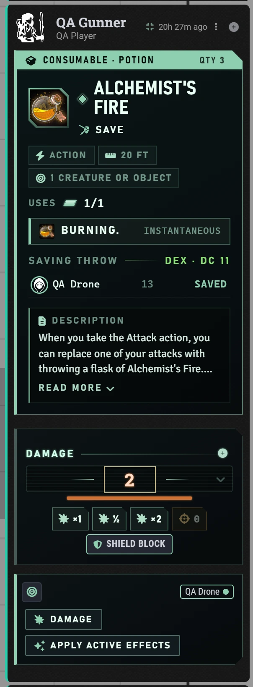</a> <strong>Alchemist’s Fire</strong> A consumable can include damage and a saving-throw table.</td>
    <td valign="top"><a href="media/item-tool.webp">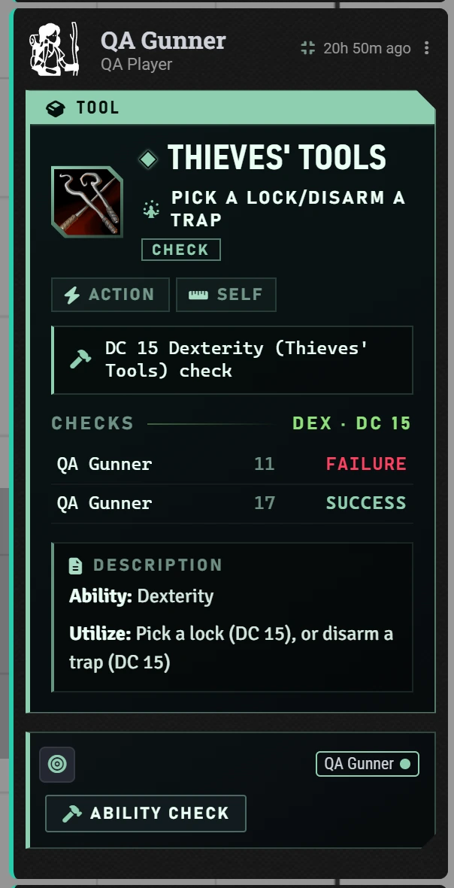</a> <strong>Thieves’ Tools</strong> The tool card collects associated check results.</td>
  </tr>
  <tr>
    <td valign="top"><a href="media/feature-second-wind.webp">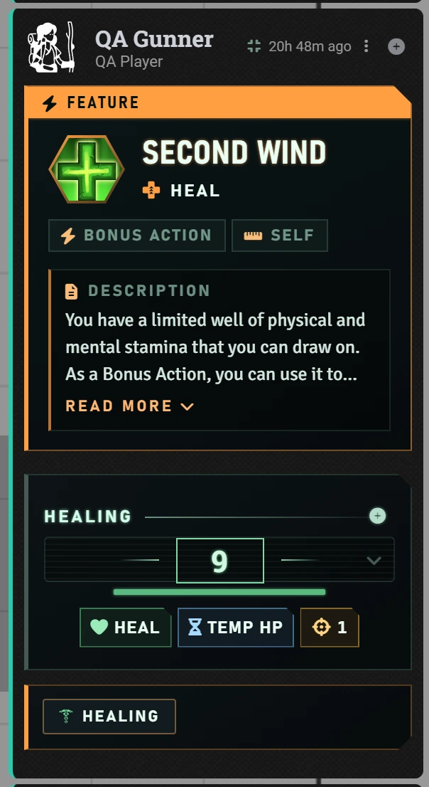</a> <strong>Second Wind</strong> A healing feature shows its result and remaining use information.</td>
    <td valign="top"><a href="media/feature-action-surge.webp">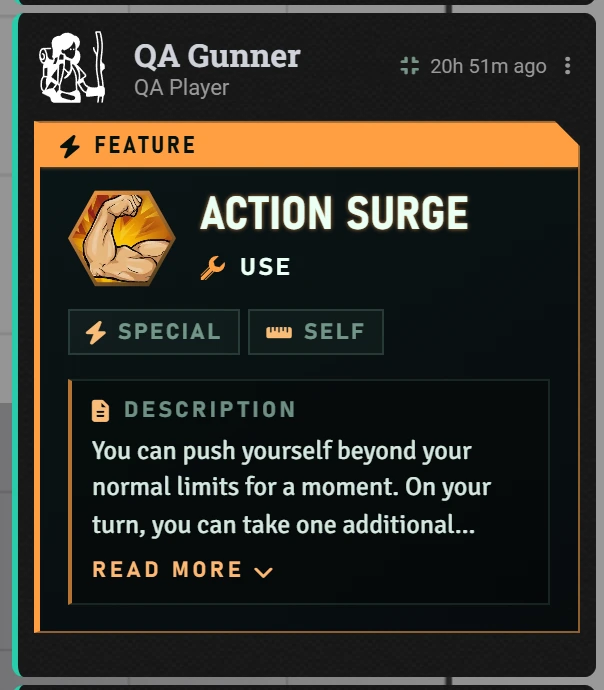</a> <strong>Action Surge</strong> A utility feature presents its use without inventing an attack.</td>
    <td valign="top"><a href="media/feature-poison-breath.webp">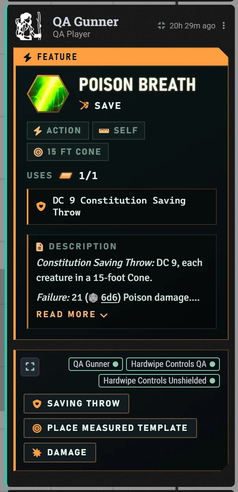</a> <strong>Poison Breath</strong> A feature with saves reports the affected targets.</td>
  </tr>
</table>

## Cyberware diagnostics

Activated implants use a diagnostic panel with their body region, status, and charges. The underlying item activities still supply attacks, saves, and effects. [Cyberware, inventory, and slots →](Cyberware.md)

*Native captures: 0.7.38.*

<table>
  <tr>
    <td valign="top"><a href="media/implant-optics.webp">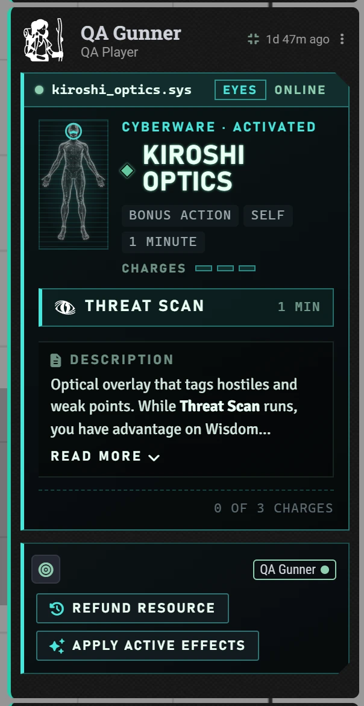</a> <strong>Kiroshi Optics</strong> An activated effect displays the implant region and charges.</td>
    <td valign="top"><a href="media/implant-blades.webp">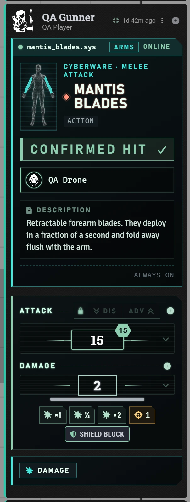</a> <strong>Mantis Blades</strong> An implant melee attack uses the shared attack and damage controls.</td>
  </tr>
  <tr>
    <td valign="top"><a href="media/implant-sonic.webp">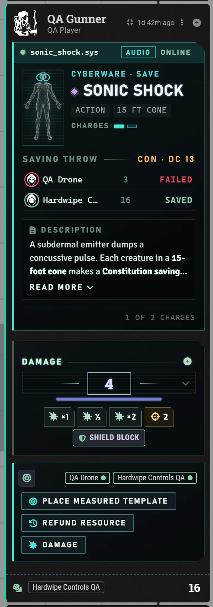</a> <strong>Sonic Shock</strong> A save-based implant displays the target saving throws.</td>
    <td valign="top"><a href="media/implant-neural.webp">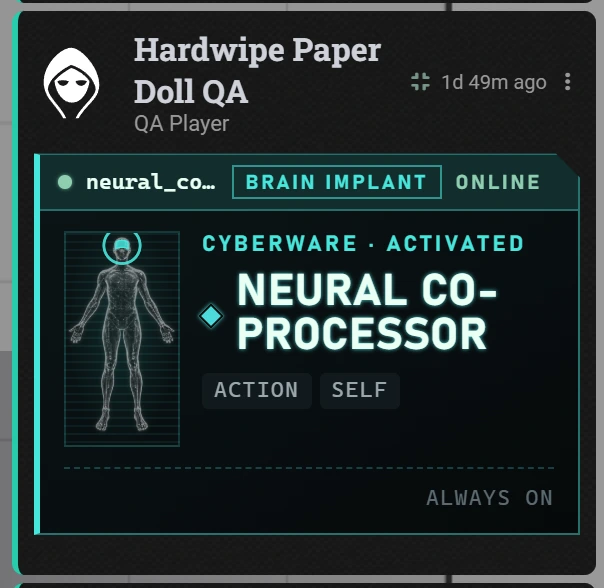</a> <strong>Neural Co-Processor</strong> An always-on implant identifies its passive status.</td>
  </tr>
</table>

## Short-rest monitor

These four captures show the dialog rather than separate chat posts. Roll one Hit Die at a time, inspect the treatment log, and complete the rest when ready. [Rests and recovery →](Rests.md)

*Native captures: 0.7.38.*

<table>
  <tr>
    <td valign="top"><a href="media/rest-8.webp">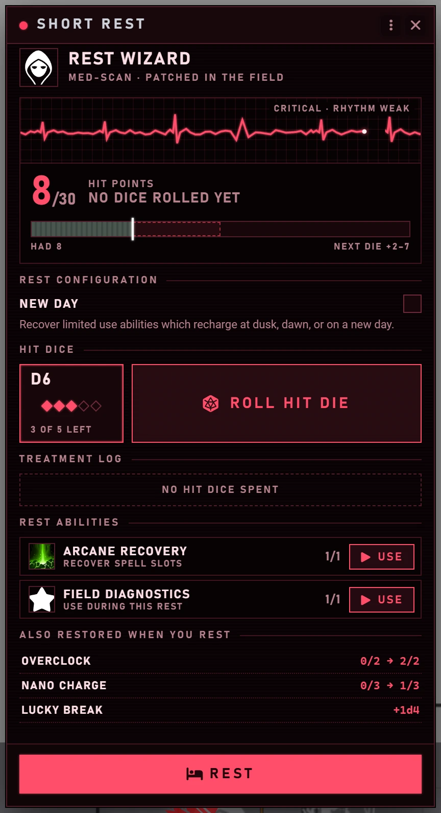</a> <strong>Critical condition</strong> The medical display is red at low HP.</td>
    <td valign="top"><a href="media/rest-15.webp">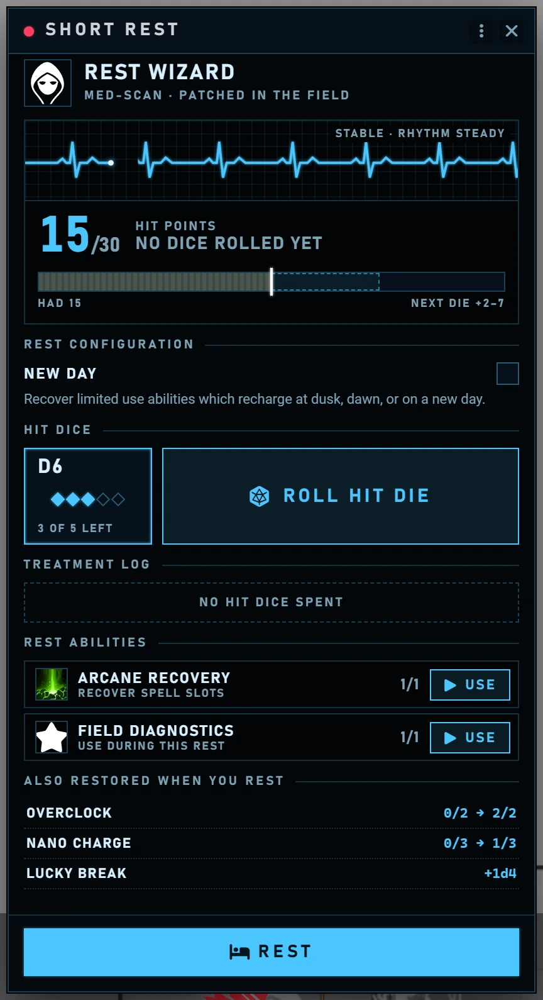</a> <strong>Stabilizing</strong> HP and the treatment log update inside the dialog.</td>
  </tr>
  <tr>
    <td valign="top"><a href="media/rest-25.webp">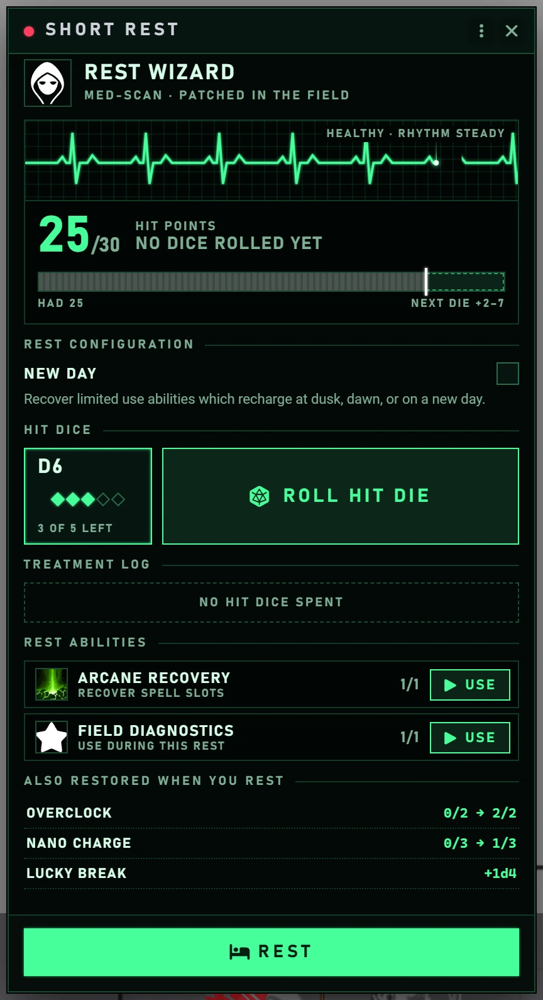</a> <strong>Healthy</strong> The monitor turns green as the character recovers.</td>
    <td valign="top"><a href="media/rest-picker.webp">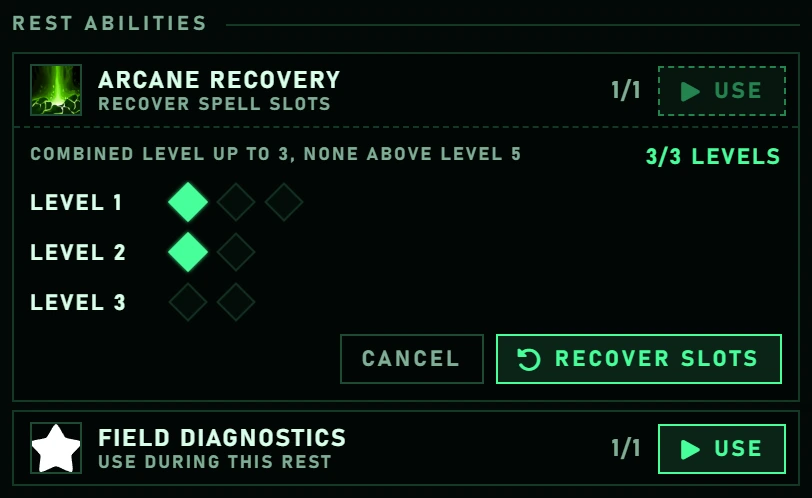</a> <strong>Spell-slot recovery</strong> Eligible recovery abilities open a picker with a level budget.</td>
  </tr>
</table>

Watch the native short-rest monitor in motion · audited preview

<a href="media/rest-medscan-live.gif">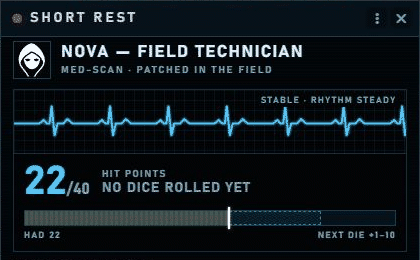</a>

Thirty sequential native captures show the running trace and one actual Hit Die expenditure. [Recording provenance](Media.md#fresh-guide-screenshots-and-recording).

## Combined rest receipts

Completing the rest posts one combined receipt. Closing early produces an incomplete receipt while preserving Hit Dice already spent and healing already received. [Read the receipt →](Rests.md#one-final-receipt)

*Native captures: 0.7.38.*

<table>
  <tr>
    <td valign="top"><a href="media/receipt-short.webp">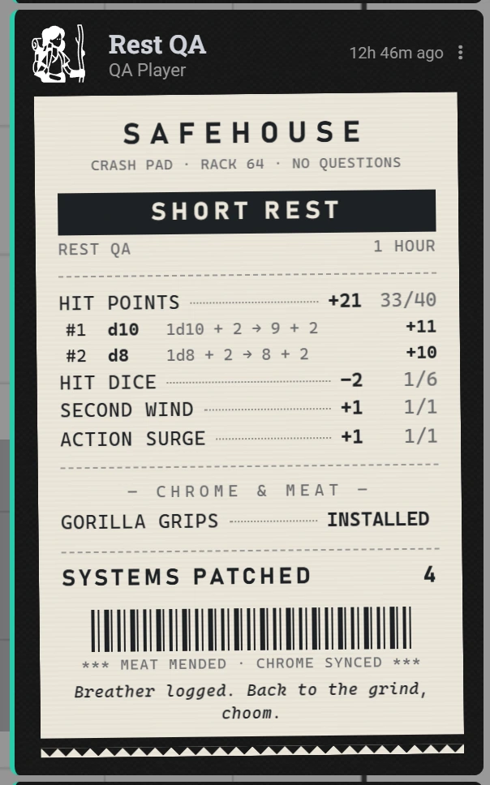</a> <strong>Short rest completed</strong> HP, Hit Dice, and recovered resources appear together.</td>
    <td valign="top"><a href="media/receipt-arcane.webp">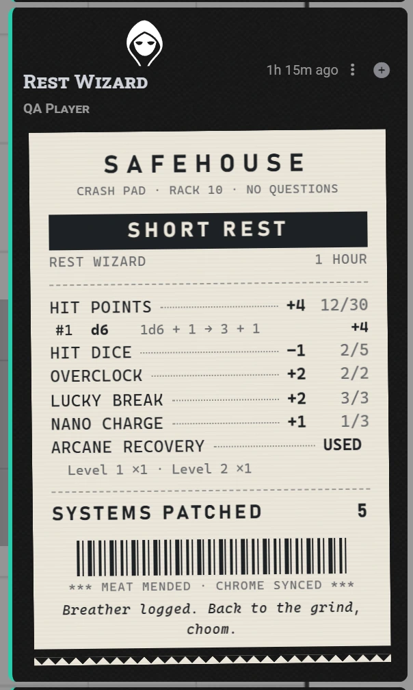</a> <strong>Recovery ability used</strong> The receipt includes recovered spell slots.</td>
  </tr>
  <tr>
    <td valign="top"><a href="media/receipt-long.webp">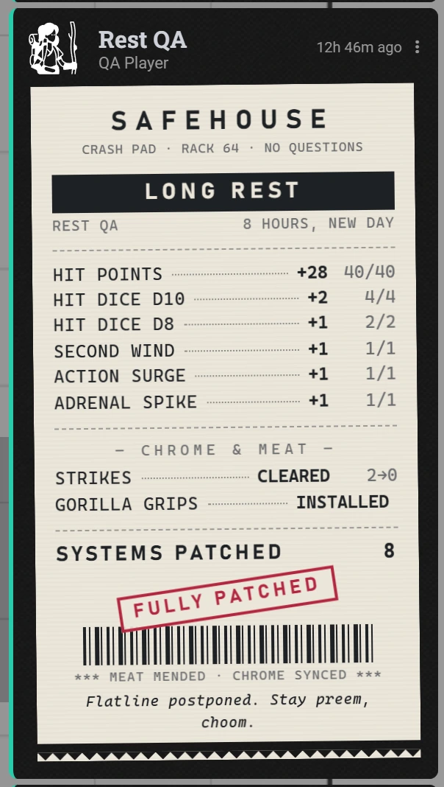</a> <strong>Long rest completed</strong> The thermal slip records the completed long rest.</td>
    <td valign="top"><a href="media/receipt-incomplete.webp">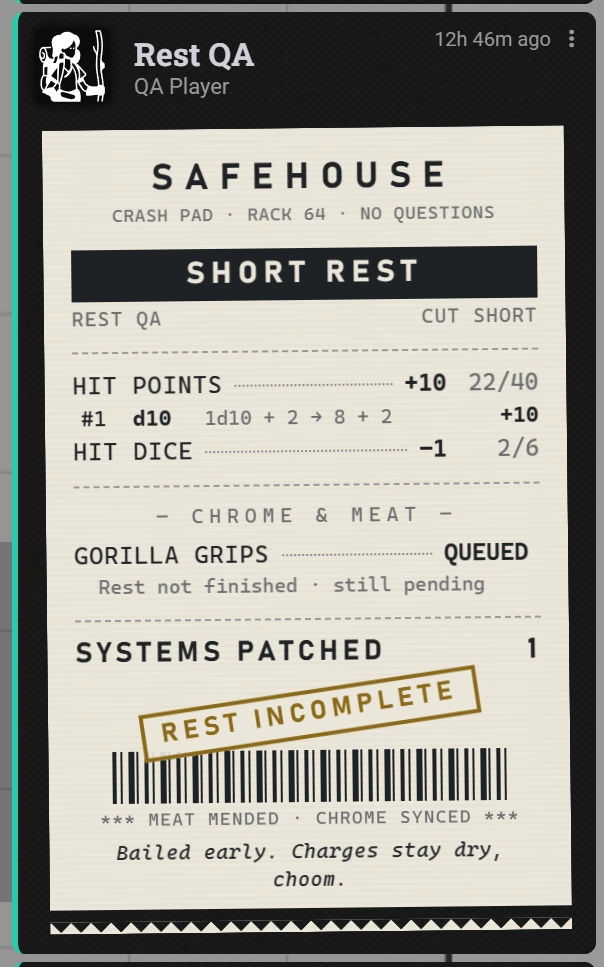</a> <strong>Rest cut short</strong> Already-rolled healing remains recorded without completing resource recovery.</td>
  </tr>
</table>

## Edge, Strikes, and Downed

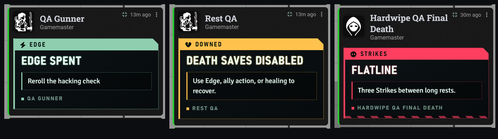

*Native captures: 0.7.39.* Edge announces a reroll expenditure. Downed directs the player toward recovery instead of death saves, and the third Strike announces Flatline. [Edge and Strikes →](Players.md#edge-strikes-and-downed)

## Shield Block

<table>
  <tr>
    <td valign="top"><a href="media/shield-choice-current.webp">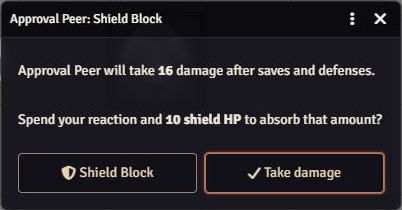</a> <strong>Reaction choice · audited preview</strong> Choose Shield Block or Take damage when an equipped shield can absorb the hit.</td>
    <td valign="top"><a href="media/shield-hud.webp">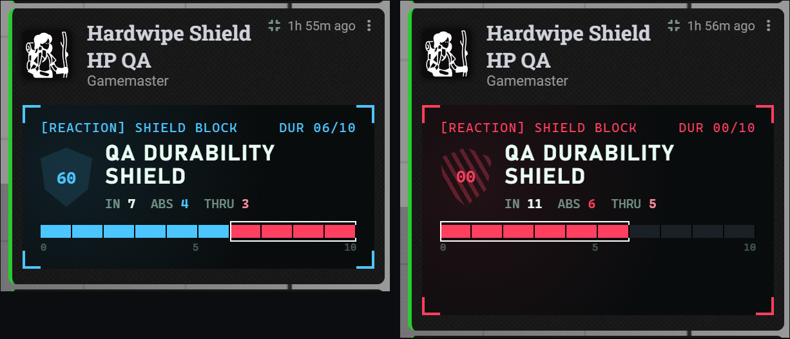</a> <strong>Durability HUD · 0.7.40</strong> The result records incoming damage, absorption, damage through, and the broken state.</td>
  </tr>
</table>

[Shield rules and timing →](Combat.md#shield-block-uses-your-reaction)

## Walls and cover review

<a href="media/wall-impact-breach-review-0.7.39.webp">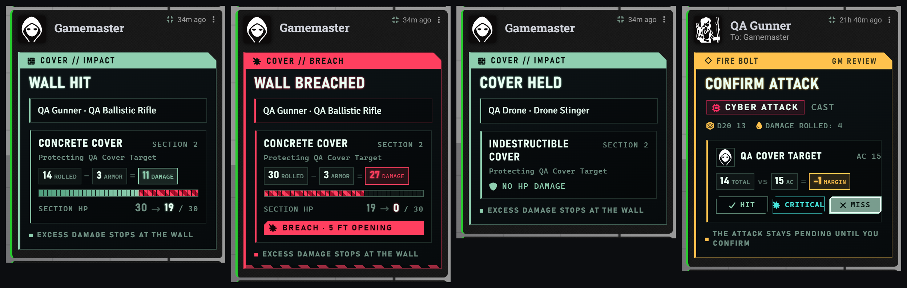</a>

*Native captures: 0.7.39.* A wall impact reports its rolled damage, armor, and section HP. Destruction announces a five-foot breach; indestructible cover reports that it held. The final example is the private attack review. Wall damage retains its separate GM **Apply damage / Ignore** decision. [Wall types, targeting, and breaches →](Walls.md)

## Party roll requests

<a href="media/party-requests-0.7.39.webp">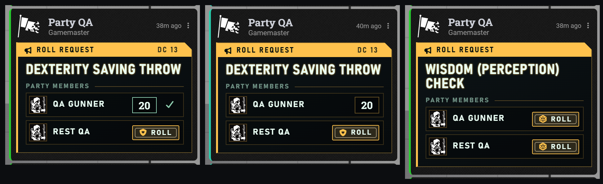</a>

*Native captures: 0.7.39.* Request a check or save from a party. Owners roll for their characters, and results replace the waiting buttons. The GM view can include information withheld from the player view. [GM roll tools and settings →](GM.md)

## Ordinary formula rolls

<a href="media/plain-rolls.webp">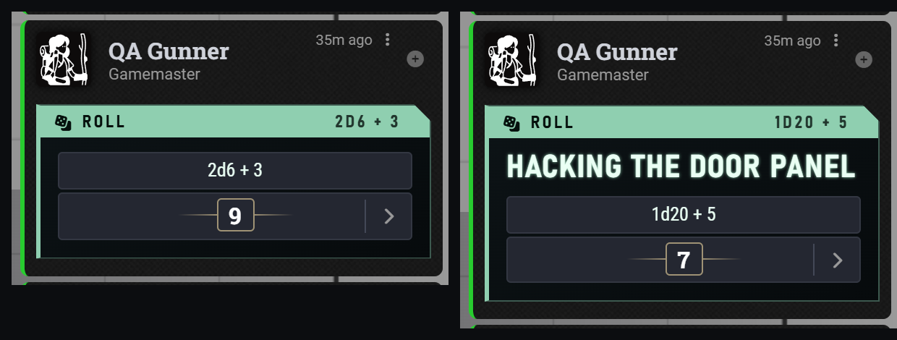</a>

*Native captures: 0.7.39.* Plain rolls keep the formula and total. A supplied flavor becomes the readable title. These are ordinary roll cards, separate from attack approval or a short-rest dialog.

## Mission Heat styles

Pick the mission’s presentation when starting it. Each style covers rising Heat, critical Heat, Lockdown, and a reduction in Heat. These montages show actual card states; they are still screenshots of interfaces that can animate. [Mission Heat →](GM.md#mission-heat)

### Threat broadcast

<a href="media/heat-threat-broadcast.webp">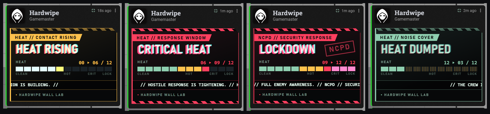</a>

*Native captures: 0.7.40.* Hazard stripes and a segmented meter announce the changing threat level.

### Corrupted feed

<a href="media/heat-corrupted-feed.webp">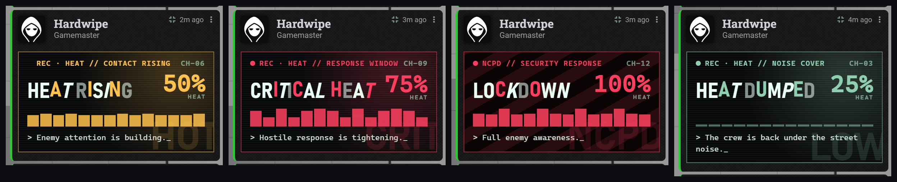</a>

*Native captures: 0.7.40.* A recording feed uses signal bars and percentages to show escalation.

### Police scanner

<a href="media/heat-police-scanner.webp">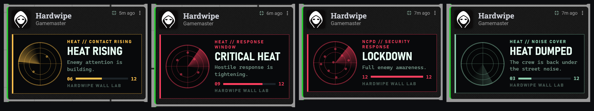</a>

*Native captures: 0.7.40.* Radar and scanner text frame the security response.

Start a mission and choose the Heat style

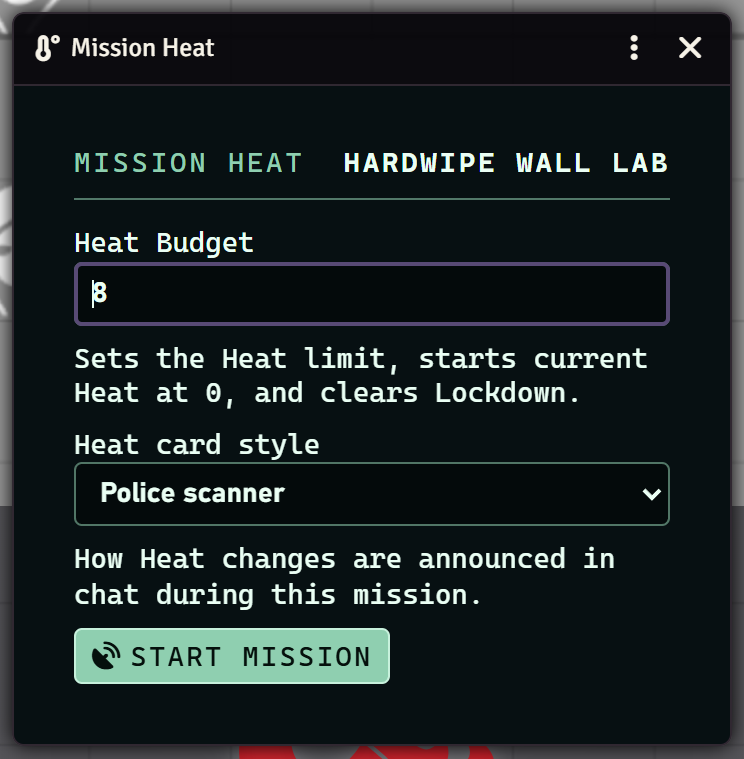

*Native capture: 0.7.40.* Set the budget and choose the style before starting the mission.

## Turn-start styles

<a href="media/turn-styles.webp">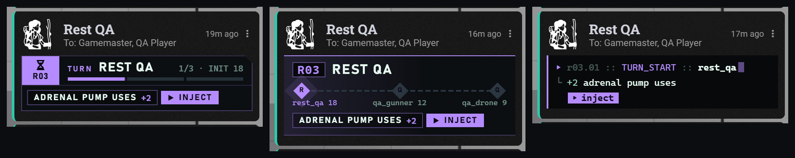</a>

*Native captures: 0.7.40.* Choose a strip, timeline, or terminal presentation. The turn prompt can expose a qualifying Adrenal Pump **Inject** action. [Turn and interface settings →](GM.md)

## Ranged source advisory

<a href="media/ranged-advisory-current.webp">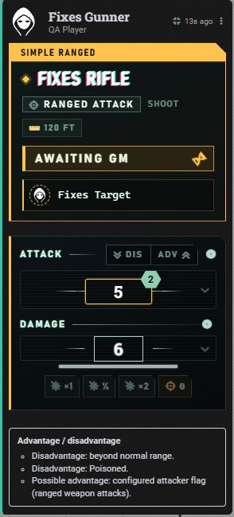</a>

*Native capture: audited preview.* Only sources actually evaluated by Ready Set Midi appear beneath the roll. No evaluated source means no box. The roller or GM chooses the roll mode; the advisory does not change it. [Ranged hints and their limits →](Combat.md#ranged-hints-name-the-actual-source)

## Make the cards readable at your table

The GM can configure card colors, spell color rules, and save-button colors. Players can choose text size and settled-card folding. [Interface configuration →](GM.md) · [Capture versions and processing →](Media.md)
