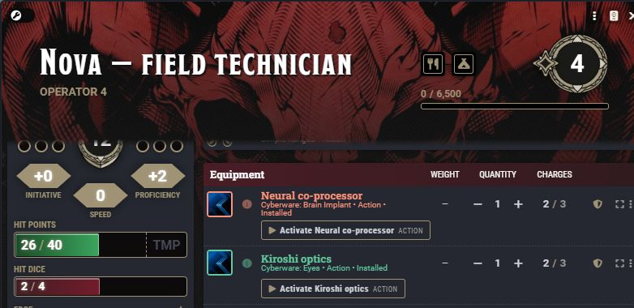

# Attacks, shields, saves, and concentration

[← Overview](../README.md) · [Player guide](Players.md) · [Walls](Walls.md) · [Card gallery](Cards.md)

## GM-confirmed attacks

| Player-facing attack | Private GM decision |
| --- | --- |
|  |  |

With **GM-confirmed attacks** enabled, every targeted creature attack waits for a GM, including GM rolls, NPC attacks, and attacks against player-owned characters. The player card reads **Awaiting GM**. The private review gives the GM the total, AC including cover, margin, and **Hit / Critical / Miss** controls for each target. Multiple targets use **Confirm all**.

Damage may already be rolled, but damage application and on-hit effects wait. Attacks with no creature target show an attack roll without inventing a verdict. Direct wall attacks use their own Apply/Ignore flow.

Natural 20 and natural 1 outcomes still require explicit confirmation. A natural 20 cannot pass through full physical wall cover. A melee total at least 10 above AC proposes a critical for the GM to confirm or downgrade.

> **Audited preview:** critical damage is combined per target before native mitigation and Shield Block. If the attacker's live workflow is gone, approval stops safely; the GM must have the attacker roll again. It does not reconstruct and automatically apply stale stored damage. See [development status](Development.md).

If no GM can review, the workflow stops without applying damage. Deleting a pending attack card cancels its waiting workflow. While a decision is pending, permitted roll-mode changes or added bonuses update the review; resolved attacks lock those controls.

## Ranged hints name the actual source

> **Audited preview:** the roller chooses Normal, Advantage, or Disadvantage. After the roll, the card lists only sources that Ready Set Midi actually evaluated for that attack, using Midi's own source labels. Conditional flags that evaluate false produce no hint. With no identified source, there is no box.

Ranged weapons and ranged spell attacks retain manual roll mode. A newly selected Thrown mode does not borrow attribution calculated for melee; if Midi has no matching source calculation, its advisory stays hidden. Ordinary melee automation keeps its existing behavior.

The advisory does not inspect conditions, guess at unevaluated flags, or turn an unlabelled native modifier into a generic reminder. Clicking Advantage is a choice, not an identified rules source. Source names stay on the rolling client and are shown only to the actor's owner or GM on that client. They are not added to shared chat flags, and the local snapshot does not survive a reload. Older guessed advisories are hidden. Range limits still apply. Rules that Midi does not identify cannot generate a hint here.

## Read and apply a roll

Click the attack or damage total to open its dice drawer. Damage types have separate colors and a proportional split bar. The **Dis / Adv** switch belongs to the roller and GM while permitted; other viewers see its state.

After approval and any required saves, whole-total controls and per-type controls can apply damage to the appropriate selected, targeted, or card-recorded tokens. **Targets** follows the card's hit and save outcomes. Applications record who applied them, their HP changes, and an **Undo** control. Do not manually apply the same damage again after the normal workflow has already applied it.

## Shield Block uses your reaction

| Block decision — audited preview | Durability and result |
| --- | --- |
|  |  |

Carry and **equip** a shield to qualify. The compact Shield Block button appears only when an applicable controllable character has one equipped. A spent reaction disables it with a reason. Wall-only impacts do not offer or spend Shield Block.

Shield HP belongs to the Equipment item and stays within 0–10. At zero, the shield is broken and unequipped. Repair or healing clears Broken without automatically re-equipping it. The editor and inventory meter read the same saved HP.

> **Audited preview:** the native block choice follows GM approval and target mitigation, before temporary HP and HP loss. The manual block path uses the same ordering. Repeated same-client HP edits are queued.

Shield Block consumes the normal Midi reaction; another reaction prevents it. The reaction resets through Midi's turn handling. The HUD tells the table how much the shield absorbed and how much reached the character.

## Saving throws

An activity with a save shows its ability, DC, and each target's Waiting, Saved, or Failed state. An owner rolls outstanding saves for their character; **Roll pending saves** lets the GM roll all outstanding saves. Results update across clients and native Midi resolution handles damage, effects, and macros.

Damage controls stay locked while required saves are outstanding. The player-save setting in Ready Set Midi determines whether players are asked to roll or the system rolls automatically. Ability-colored controls can be changed to amber in Hardwipe settings.

## Concentration

| Damage interrupt | Successful save | Failed save |
| --- | --- | --- |
|  |  |  |

Taking damage while concentrating posts a private request to the character's owners and GM. It names the running spell, damage, and save DC. Press **Roll CON save** to use the normal dialog for advantage and bonuses. The request does not roll automatically.

A successful save switches the program to Recovered; a failed save displays the crash. The associated save card collapses to one line and can be reopened. Ready Set Midi's end-on-failure behavior still applies. When the host is unconscious or incapacitated, **Host offline** offers **End program** to end concentration.

The [card gallery](Cards.md) also shows ended programs, collapsed concentration saves, spell attacks, healing, normal checks, and critical misses.
