# Attacks, shields, saves, and concentration

[← Overview](../README.md) · [Coup de Grace](#coup-de-grace) · [Variant initiative](#variant-initiative) · [Player guide](Players.md) · [Walls](Walls.md) · [Card gallery](Cards.md)

## GM-confirmed attacks

| Player-facing attack | Private GM decision |
| --- | --- |
| 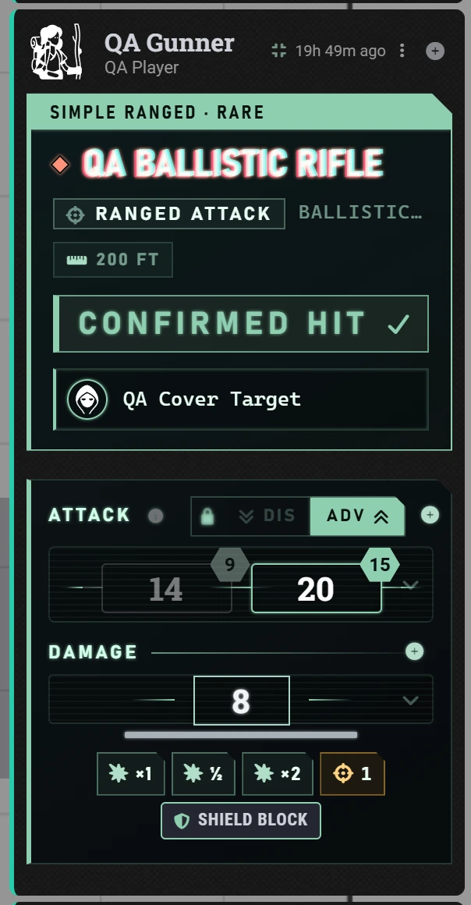 | 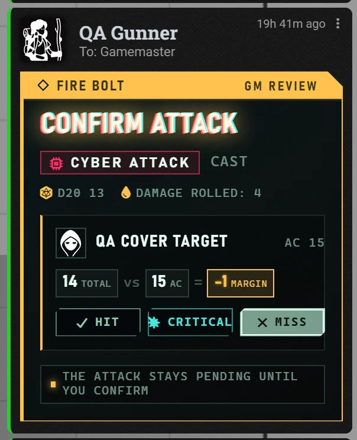 |

With **GM-confirmed attacks** enabled, every targeted creature attack waits for a GM, including GM rolls, NPC attacks, and attacks against player-owned characters. The player card reads **Awaiting GM**. The private review gives the GM the total, AC including cover, margin, and **Hit / Critical / Miss** controls for each target. Multiple targets use **Confirm all**.

Damage may already be rolled, but damage application and on-hit effects wait. Attacks with no creature target show an attack roll without inventing a verdict. Direct wall attacks use their own Apply/Ignore flow.

The attack card stays out of the chat log while Ready Set Midi rolls the attack, checks hits and rolls damage, and appears once it is complete. The GM's review appears with it. If a workflow stalls, the card shows after a few seconds in whatever state it reached.

Natural 20 and natural 1 outcomes still require explicit confirmation. A natural 20 cannot pass through full physical wall cover. A melee total at least 10 above AC proposes a critical for the GM to confirm or downgrade.

> **Audited preview:** critical damage is combined per target before native mitigation and Shield Block. If the attacker's live workflow is gone, approval stops safely; the GM must have the attacker roll again. It does not reconstruct and automatically apply stale stored damage. See [development status](Development.md).

If no GM can review, the workflow stops without applying damage. Deleting a pending attack card cancels its waiting workflow. While a decision is pending, switching the roll to advantage or disadvantage, or adding a bonus, keeps the damage on the card and posts a fresh review with the new total. A natural 20 that only arrives with advantage counts as a critical. Once the GM has ruled, the attack roll is settled: the advantage switch and the attack's bonus button lock. *(Next release.)* An Edge **Reroll** is the exception: if the new die flips a ruled hit into a miss (or a miss into a hit), the card asks the GM to rule again. **Miss · take back damage** returns the damage applied to that target; **Hit · apply damage** applies it.

## Coup de Grace

*(Next release.)* Hit a mook that is **Surprised** and it dies: the target drops to 0 HP, whatever the damage. Melee, ranged and spell attacks all count. A mook is any creature that isn't a player character and has no Legendary Resistance. Mark surprised creatures with D&D5e's **Surprised** status on the token.

Once the mission's Heat reaches **Critical**, enemies are alert and Coup de Grace is off. With no mission running, it applies.

With GM-confirmed attacks on, it's the GM's call: when Coup de Grace can apply, the target's review row gets its own **Coup de grâce** button under **Hit / Critical / Miss**. Choosing it counts as a hit (a natural 20 stays a critical) and drops the target. **Hit** stays an ordinary hit. The attack card stamps the target **Coup de grâce**. With the review off, there is no one to ask, so a hit recorded by Ready Set Midi kills a qualifying mook automatically, applied by the GM's client, so a GM must be online.

## Variant initiative

*(Next release.)* A player character's initiative can be a skill check. The window that opens on rolling (sheet or combat tracker), in the pirate radio or the NCPD dispatch voice by turns, offers ordinary initiative, then every skill with its bonus; the chosen skill's total replaces D&D5e's initiative modifier, proficiency and initiative bonuses, while condition penalties and the Dexterity tiebreaker stay. D&D5e's roll dialog is skipped after the window, and advantage is set on the initiative card's switch. The card's label names the skill. NPCs, fixed initiative scores, and the GM's **Roll All** / **Roll NPCs** stay ordinary initiative.

## The roll mode scan names the actual source

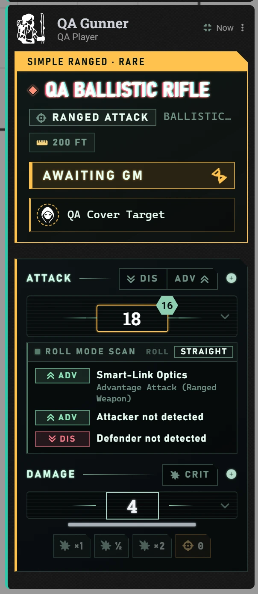

Under an attack roll, the **roll mode scan** lists the advantage and disadvantage sources Ready Set Midi evaluated for that attack, by name, and the mode they add up to: **ADV**, **DIS** or **Straight** (the two cancel; a block strikes out its side). For a ranged attack you choose the mode, so the scan tells you what to roll. A melee attack's mode is set by Midi; its scan appears only when the roll had advantage or disadvantage, and reads **Applied**. No source, no box.

Only the attacker's owner and the GM see the scan. A rule the target grants reads **Granted by the target** for players. A player character's scan is saved on the card; an NPC's sources stay on the GM's screen. The GM also sees an **Unlabelled modifier** row when something outside any named rule changed the roll.

## Roll rules on the sheet

The **Roll rules** panel at the bottom of a character's Turn tab (an NPC's: under Features, for the GM) lists what is in force on the character now, each rule named after its cause: an effect and its feature, or the condition or armor behind one of D&D5e's own modes. Rules against the character are under **Rolls against you**. To add a rule, give the feature or implant an Active Effect with a Midi flag such as `flags.midi-qol.advantage.attack.rwak`; the effect's name is what players read.

**Modes.** A feature can offer modes the player switches on from the panel: a stance, an aim setting. Each is an Active Effect on the feature that the GM marks **Hardwipe mode** and leaves suspended. One mode per feature is on at a time.

**Conditions.** D&D5e lists the conditions that give disadvantage on attack rolls but nothing applies them to attacks, so Hardwipe does, following the world's rules version: Poisoned, and under the 2014 rules Exhaustion 3. It stands aside when another module's condition effect already gives that disadvantage.

Code and macros add named sources through `game.hardwipe.rules.register` or the `hardwipe.attackSources` hook; see the [reference](Reference.md).

## Read and apply a roll

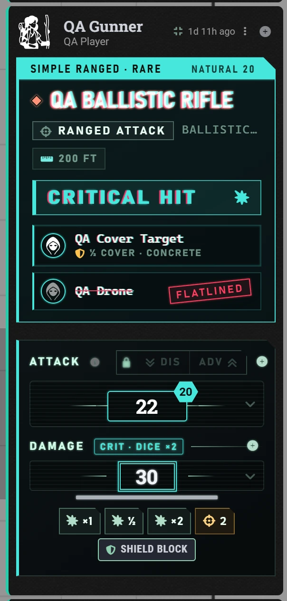

Click the attack or damage total to open its dice drawer. Damage types have separate colors and a proportional split bar. The **Dis / Adv** switch belongs to the roller and GM while permitted; other viewers see its state.

After approval and any required saves, whole-total controls and per-type controls can apply damage to the appropriate selected, targeted, or card-recorded tokens. **Targets** follows the card's hit and save outcomes. Applications record who applied them, their HP changes, and an **Undo** control.

When Ready Set Midi applies the damage itself, that application is logged on the card too, as **Auto**, with the same **Undo**. Do not apply the same damage again by hand.

**Changed rolls follow through.** If the damage changes after it was applied (a reroll, a bonus, critical dice), the GM's client adjusts each logged application by the difference, through dnd5e's resistances and immunities, and marks it *adjusted*. *(Next release.)* The difference is taken against what each target actually lost, so a target that bottomed out at 0 HP doesn't get back hit points it never lost. A save that flips after an Edge reroll redoes that target's damage at the new multiplier (failed ×1, saved ½ or none). **Undo** restores the hit points from before the first application. Adjustments need a GM online. Damage undone from Ready Set Midi's own damage card is not tracked by this log.

**CRIT** on the damage line rolls the damage dice again and adds them: the roller may use it until the GM rules, the GM at any time. When the roller adds critical dice, the GM's review says so, and a later **Critical** decision does not add a second set.

## Shield Block uses your reaction

| Block decision — audited preview | Durability and result |
| --- | --- |
| 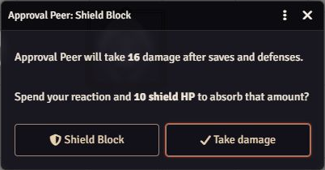 | 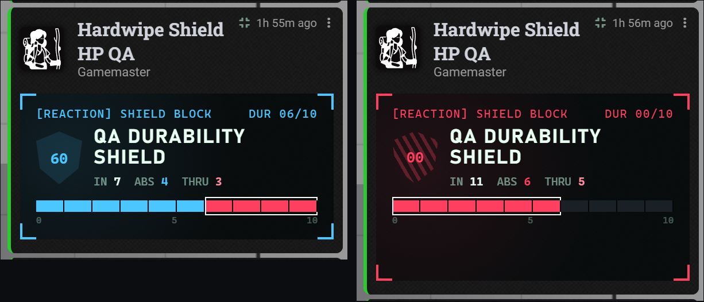 |

Carry and **equip** a shield to qualify. The compact Shield Block button appears only when an applicable controllable character has one equipped. A spent reaction disables it with a reason. Wall-only impacts do not offer or spend Shield Block.

Shield HP belongs to the Equipment item and stays between 0 and the shield's maximum: 10 unless the GM sets another (1 to 99) in the **Max HP** field on the shield's sheet. At zero, the shield is broken and unequipped. Repair or healing clears Broken without automatically re-equipping it. The editor and inventory meter read the same saved HP.

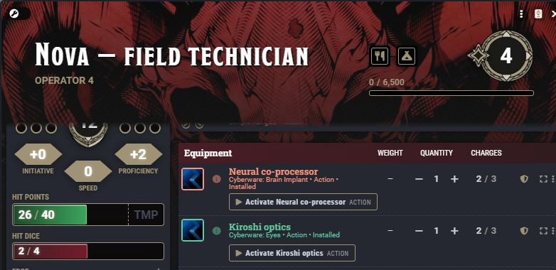

> **Audited preview:** the native block choice follows GM approval and target mitigation, before temporary HP and HP loss. The manual block path uses the same ordering. Repeated same-client HP edits are queued.

Shield Block consumes the normal Midi reaction; another reaction prevents it. In combat it follows the **Reaction** chip of your [Turn tab](Players.md#read-your-turn): while that reads **Spent**, whether Ready Set Midi or Hardwipe counted it, Shield Block is unavailable. The reaction comes back when your turn starts. The HUD tells the table how much the shield absorbed and how much reached the character.

## Saving throws

| The save card | Asking for saves | Choosing one effect |
| --- | --- | --- |
| 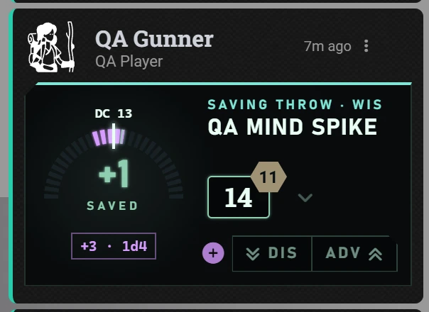 | 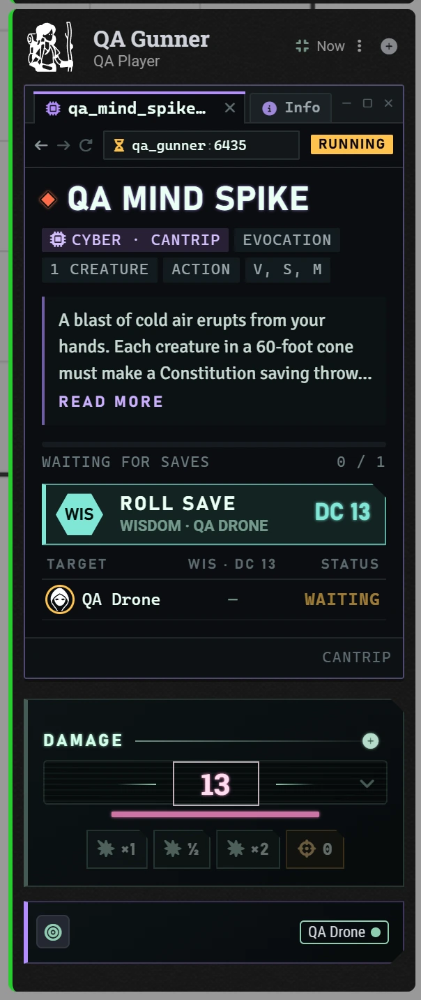 | 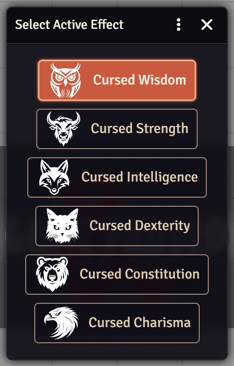 |

**The save card.** A saving throw is a dial. The DC sits at the top of the arc; the reading sweeps right of it by how much the save cleared, or falls short to the left (up to 10 either way), and the middle shows the difference (Δ) over **Saved** or **Failed**. Beside it are the ability, what forced the save, the roll, the **+** button and the DIS / ADV switch. **+** adds a bonus after the roll (Bless, Guidance, or any formula); the card shows it as a violet chip and a violet slice of the arc and re-reads the verdict. The switch changes the roll after the fact; with advantage or disadvantage both dice sit side by side, the kept one first.

A natural 20 pegs the reading into a **redline** zone at the top of the scale, and the needle bounces off the limiter. A natural 1 **cracks** the gauge: dead segments, a crack across the glass, the result knocked out of line. The motion plays once, on a roll made in the last few seconds; reloaded cards and reduced motion show the settled state. A natural 20 that still misses the DC shows a plain fail.

A save rolled from the sheet, with no DC, has no verdict and no label. Its arc runs from the lowest total the roll could make to the highest (with advantage, still one d20's range), and the middle shows the total. Death saves and concentration saves keep their own cards.

**Asking for saves.** An activity with a save shows its ability, DC, and each target's Waiting, Saved, or Failed state. Whoever owns a target that still has to roll gets an ability-colored **Roll save** button; the GM gets one for the NPC targets (**Roll pending saves** when there are several). Results update across clients and native Midi resolution handles damage, effects, and macros. Damage controls stay locked while required saves are outstanding. Ability-colored controls can be changed to amber in Hardwipe settings.

**NPC saves.** On first load, Hardwipe sets Ready Set Midi's **Roll NPC saves** (and linked NPC saves) from *Auto* to *Chat Message*, once per world, with a notice. With *Auto*, Midi rolls NPC saves the moment a spell lands and the card never shows the GM a button. Midi's one-line chat request is hidden because the card's button covers it. Set it back to *Auto* in Ready Set Midi's settings if you prefer; Hardwipe will not change it again. If nobody rolls within Ready Set Midi's save timeout, Midi rolls the save itself.

**One effect from several.** An activity that carries several effects for its targets usually means "one of these": Bestow Curse lists a curse per ability, Blindness/Deafness both conditions. Ready Set Midi's automatic effects would apply all of them. Hardwipe turns on Midi's **Choose effects** for such activities, so the caster picks the effect that lands. The world setting **Choose one effect when an activity has several** turns this off for activities that stack effects on purpose.

## Concentration

| Damage interrupt | Successful save | Failed save |
| --- | --- | --- |
| 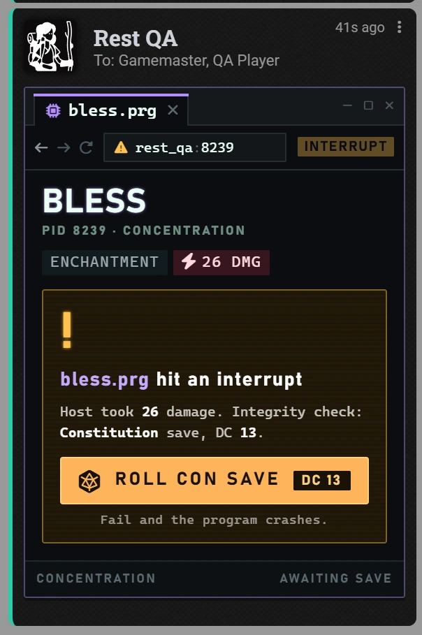 | 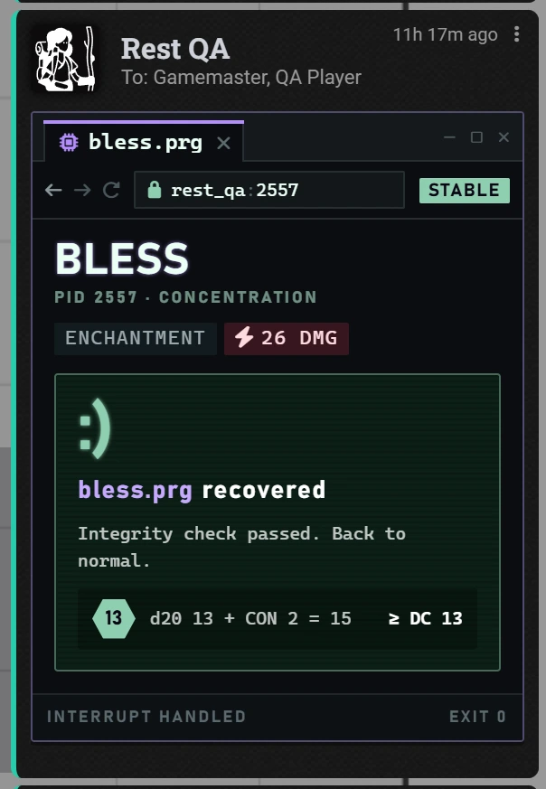 | 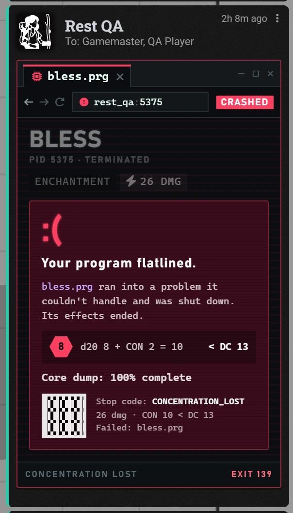 |

Taking damage while concentrating posts a private request to the character's owners and GM. It names the running spell, damage, and save DC. Press **Roll CON save** to use the normal dialog for advantage and bonuses. The request does not roll automatically.

A successful save switches the program to Recovered; a failed save displays the crash. The associated save card collapses to one line and can be reopened. Ready Set Midi's end-on-failure behavior still applies. When the host is unconscious or incapacitated, **Host offline** offers **End program** to end concentration.

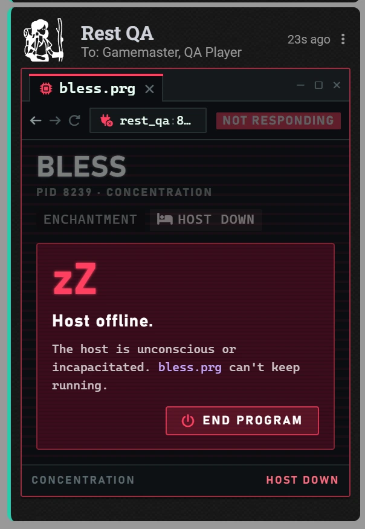

The [card gallery](Cards.md) also shows ended programs, collapsed concentration saves, spell attacks, healing, normal checks, and critical misses.
