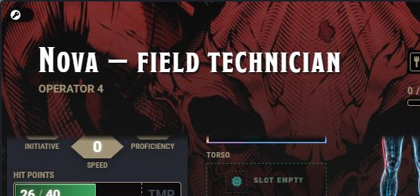
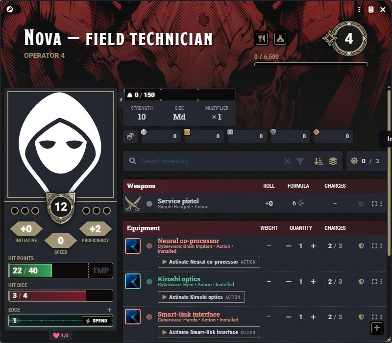
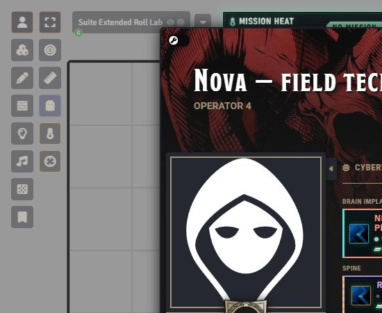

# Cyberware and personal paper dolls

[← Overview](../README.md) · [Player guide](Players.md) · [Rests](Rests.md)

## One item, two useful views

Cyberware is ordinary **Equipment** in the character's inventory. Choosing a **Cyberware: …** equipment category makes that same item appear in the corresponding Cyberware region. There is no second inventory or duplicate weapon. Existing items need their category set explicitly.

1. Create or edit an Equipment item.
2. Set its equipment category to the appropriate **Cyberware** region.
3. Add ordinary Active Effects for passive benefits and D&D5e Activities for actions.
4. Queue its installation from the Cyberware tab and complete a qualifying rest.

Installed cyberware replaces common attunement for those items; ordinary equipment keeps native attunement. The equip indicator reflects installation and cannot skip the swap process.

## Slots and service

| Region | Package capacity | Installation or removal |
| --- | --- | --- |
| Brain Implant | One | Short or long rest with a Ripperdoc |
| Spine | One | Short or long rest with a Ripperdoc |
| Torso | One | Short or long rest with a Ripperdoc |
| Arms | One paired package | Short or long rest with a Ripperdoc |
| Hands * | One paired package | Self-service during a short or long rest |
| Legs * | One paired package | Self-service during a short or long rest |
| Eyes * | One paired package | Self-service during a short or long rest |
| Nervous System | One | Short or long rest with a Ripperdoc |
| Audio | One | Short or long rest with a Ripperdoc |
| Dermal | One | Short or long rest with a Ripperdoc |

Carry as many alternatives as inventory allows. A region holds one installed package, including paired Hands, Legs, Eyes, or Arms. Select its slot to open the category's items and controls below the doll.

The GM sets Ripperdoc and tools access through the collapsed **Service** control. The module does not infer service from nearby NPCs. A rest without the required service still completes, but the affected swap stays queued.

## Read the state before using it

| State | Occupies the region? | Passive effects and activities |
| --- | --- | --- |
| Carried | No | Unavailable |
| Installed and enabled | Yes | Available |
| Disabled | Yes | Unavailable |
| Damaged | Yes | Unavailable |
| Queued change | Current installation remains | Current state applies until a qualifying rest finishes |

**Install** and **Remove** queue a change. A replacement queues removal of the old package and installation of the new one together. **Cancel** preserves the current installation. Owners can disable an installed, undamaged implant. **Reset** clears disabled state; **Repair** clears damage. Both service actions require tools, Ripperdoc access, or a GM override.

Working implants apply their normal transferred passive Active Effects. Effects explicitly disabled by the user remain disabled. Swapping does not refill charges unless the item's normal recovery rules do so.

## Active cyberware belongs beside weapons

Configure an Activity on the Equipment item for an action, bonus action, reaction, attack, or other activation. Its real activity name and cost appear in Inventory and in the Cyberware detail panel. Hidden activities stay hidden. The disabled and damaged examples in the sheet retain their slots but lose usable action controls.

Using the activity posts a diagnostic card with the region, charges, effect information, and normal activity buttons. Attack and save activities also receive the appropriate combat controls.

## Rarity colors

With **SC – Item Rarity Colors** active, filled slots and item names follow its inventory border and title settings, including supported custom tiers, gradients, and glow. The current screenshot shows different rarity frames. State edges and labels remain visible so rarity cannot conceal Disabled or Damaged. Without SC, Hardwipe uses its own palette. Compatibility was verified against SC 3.0.14.

## Personal paper dolls

Right-click the body image and choose **Choose paper doll image**. Owners and GMs can select an image through Foundry's picker. Owners without Browse Files permission get a compact path-or-URL dialog instead. After choosing a custom image, the same menu offers **Use default paper doll**. Keyboard users can focus the doll and press **Shift+F10**.

Use a transparent PNG or WebP with the full figure visible; **1024 × 1536** is the recommended portrait frame. The image preserves its aspect ratio and saves per character. Canceling the picker keeps the previous choice. A missing custom image falls back to the default while retaining its saved path.

The default scan has no continuous nose-to-pelvis line. Its region overlays highlight installed and selected equipment. Custom images hide those fixed-coordinate overlays because body proportions can differ; the slots, rarity frames, item controls, and selection still work. Changing the artwork never changes the character's equipment or effects.

Hardwipe supplies the equipment framework, not a balanced implant compendium, universal EMP attack, humanity score, or cyberpsychosis system.
