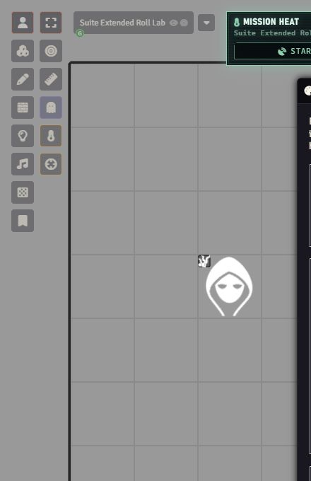

# GM setup and interface controls

[← Overview](../README.md) · [Player guide](Players.md) · [Walls](Walls.md) · [Combat](Combat.md)

## Installation and first run

The public pair is **Hardwipe 0.7.40 + Ready Set Midi 14.0.10.1**, tested on **Foundry 14.367 / D&D5e 6.0.5**. Install both together from the [release page](https://github.com/TobbyClay/hardwipe-ruleset/releases/latest).

| Install | Manifest |
| --- | --- |
| Hardwipe | `https://github.com/TobbyClay/hardwipe-ruleset/releases/latest/download/module.json` |
| Custom Ready Set Midi | `https://github.com/TobbyClay/hardwipe-ruleset/releases/latest/download/ready-set-midi-module.json` |

Enable Hardwipe, the custom Ready Set Midi fork, libWrapper, socketlib, and DAE. Keep standalone Midi-QOL and Ready Set Roll disabled when using the fork. Manual ZIPs contain module-named root folders for Foundry's `Data/modules` directory.

Set a character's sheet to **Hardwipe Character** if it explicitly uses another sheet. Hardwipe's default registration does not override an actor's saved sheet preference.

For a first-session setup: configure implant categories and service access, leave GM-confirmed attacks enabled, assign types to destructible scene walls, then start Mission Heat when the job begins.

## Mission Heat

Use **Start Mission** on the Heat HUD. Choose the mission maximum and card style. The meter tracks the scene's escalation, with Hot at 50%, Critical at 75%, and Lockdown at its maximum. Drag the HUD by its header; each client's position persists. The thermometer in Token Controls shows or hides it.

| Threat broadcast | Corrupted feed | Police scanner |
| --- | --- | --- |
|  |  |  |

All styles record Heat changes. The broadcast uses hazard strips and a ticker; the feed uses camera noise and displaced text; the scanner uses radar contacts. Reduced motion stops the animated effects. Older Heat messages use the broadcast fallback without the newer meter.

## Turn starts and party requests

The **Turn start card** setting selects Ticker strip, Initiative timeline, or Terminal line. Each keeps the turn's activity buttons usable and shows relevant recovered resources. Hidden combatants are omitted from the public order.

Native party roll requests use matching cards, showing the requested roll, DC when visible, each member's result, and outstanding Roll buttons. Request visibility still follows the system's permissions and message mode.

## Colors, text, folding, and motion

Open **Game Settings → Hardwipe Ruleset → Card colours**. The GM palette covers card families, system messages, results, abilities, damage types, turn starts, and roll requests. Changes recolor existing messages for everyone. Reset an individual color or use **Reset all**.

Spell colors have separate modes: one base color, by school, by player, or per spell. In per-spell mode, the spell Details tab exposes **Card colour**. SC – Item Rarity Colors can supply enabled school colors and item rarity styling.

**Card accent** selects Hardwipe phosphor or D&D5e gold on attack/spell controls. **Saving throw colours** can use ability colors or amber. Each player chooses **Card text size** independently.

**Fold settled cards after** accepts Never, 2, 5, or 10 minutes. Settled cards fold to useful titles and totals; pending saves and GM decisions remain open. Folding pauses while browsing older chat. Reopening a card is local to the viewer's session.

Fresh rolls have short entry animations; old cards do not replay them after reload. Reduced-motion preferences suppress animation.

## When something looks wrong

| Symptom | Check |
| --- | --- |
| No Cyberware tab | Actor uses Hardwipe Character; item is Equipment with a Cyberware category |
| Implant action unavailable | Installed, enabled, undamaged, and has a visible normal Activity |
| Swap stays queued | Rest completed and required Ripperdoc service is enabled |
| Every wall is indestructible | Apply a type to the scene wall; creating a preset alone is insufficient |
| No styled cards | Hardwipe and the matching Ready Set Midi fork are active; conflicting roll modules are disabled; reload clients after updating |
| Shield Block missing | Applicable owned character has an equipped shield; reaction availability is separate |
| Attack waits forever | Active GM is connected; review belongs to the current roll; check the development notes for audited workflow fixes |
| Breach still drawn on map | Background art is unchanged; Foundry collision and vision geometry are what open |

Use the [card gallery](Cards.md) to compare expected output. Reports should include module/system/core versions, GM or Player role, the exact activity, the visible card, and a minimal reproduction without private campaign data.
