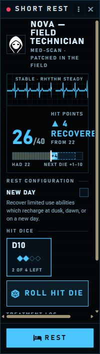

# Rests and recovery

[← Overview](../README.md) · [Player guide](Players.md) · [Cyberware](Cyberware.md)

## Roll one Hit Die at a time

1. Open **Short Rest** on the character sheet.
2. Choose an available Hit Die size and press **Roll Hit Die**.
3. Read the new HP and running recovered total. Roll another die if needed.
4. Use any eligible rest ability, then complete the rest.

Each die rolls inside the dialog. Open its treatment-log entry to inspect faces, modifiers, formula, and healing capped by maximum HP. Multiclass characters retain their available die sizes. Native D&D5e handles Constitution, roll modifiers, consumption, and the HP cap.

Individual dice do not post separate chat cards. Completing the rest sends one combined receipt and runs normal resource recovery and qualifying implant swaps.

## The monitor shows recovery as it happens

| Critical | Stable | Healthy |
| --- | --- | --- |
|  |  |  |

The health color changes from red below one third of maximum HP, to blue below two thirds, then green. The HP bar distinguishes starting HP from each die's healing and previews the next die's possible range. The trace animates like a medical monitor and stops under reduced motion.

This live recording shows the monitor's motion and one real Hit Die recovery. [Static alternative](media/rest-current.png).

## Rest abilities and spell-slot recovery

**Rest abilities** lists native short-rest activities plus Arcane Recovery and Natural Recovery. **Use** runs the feature. Those two recovery features open a picker: select expended slots within the feature's level budget, then press **Recover slots**. No slot above level 5 is eligible.

**Also restored when you rest** previews item and feature uses, pact slots, resources, and queued cyberware. **New Day** adds dawn, dusk, and daily recovery. The feature must actually belong to the character and have an available use; the interface does not grant it.

## One final receipt

| Completed short rest | Recovery feature used |
| --- | --- |
|  |  |

The receipt records HP, Hit Dice, recovered slots and uses, rest abilities, and implants installed, removed, or left queued. Long rests also record relevant Strikes and Downed recovery. Viewers without character access receive the limited HP and Hit Dice information allowed by D&D5e.

## Closing early and long rests

| Closed before completion | Long rest |
| --- | --- |
|  |  |

Hit Die consumption and healing apply immediately. Closing the dialog preserves them and posts **Rest incomplete**, but does not finish the rest, restore rest resources, or commit queued swaps. Reopening on the same client focuses the existing dialog while it remains open.

Long rests retain their normal dialog and resource rules with a styled receipt. A character on three Strikes stays dead through an ordinary rest. Hit Dice rolled directly from the sheet, party rest requests, and other modules' replacement rest dialogs retain their own workflows.

For implant swaps, Hands, Legs, and Eyes are self-service; other regions require a short or long rest with Ripperdoc access. [See all slot rules](Cyberware.md#slots-and-service).
