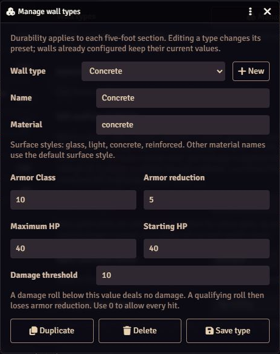
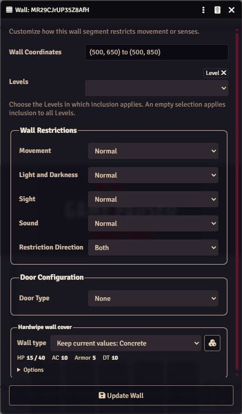
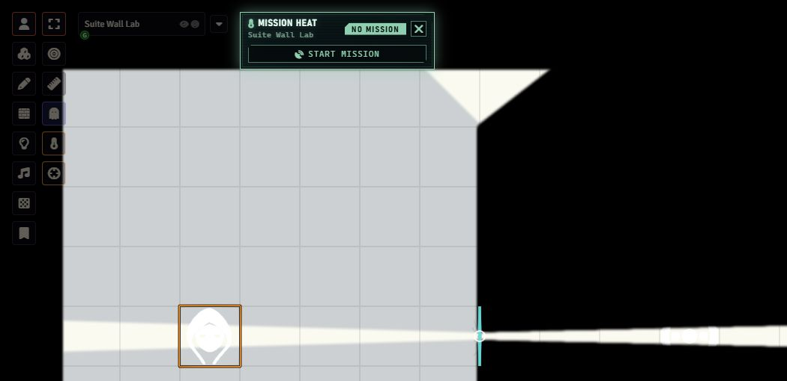
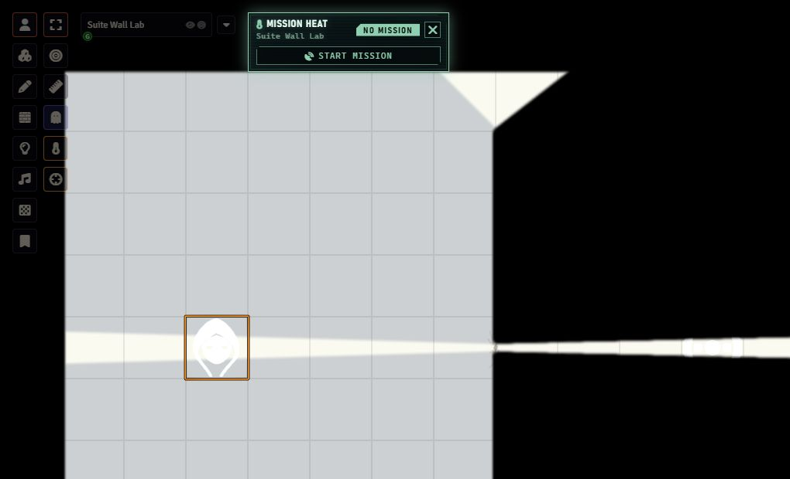

# Walls: cover, durability, glimpses, and breaches

[← Overview](../README.md) · [GM setup](GM.md) · [Combat](Combat.md) · [Exact cover math](Reference.md#cover-calculation)

## Give a wall durability

| Manage presets | Apply a type to a wall — audited preview |
| --- | --- |
|  |  |

1. Open **Game Settings → Hardwipe Ruleset → Manage wall types**.
2. Create or edit a type with its material appearance, AC, maximum HP, starting HP, armor reduction, and damage threshold.
3. Select the scene wall and assign that type. In the public release, use **Wall Controls → Configure wall cover**. The audited preview also puts a compact Hardwipe section at the **bottom** of the native Wall Configuration window.
4. Save. Enable **Show damage and glimpses** for visible wear and sight/light slits.

Untagged solid walls are **indestructible cover**. A type existing in the manager does not assign it to every scene wall. Explicitly apply a type to each intended wall or selection.

| Initial type | AC | HP per five-foot section | Armor per impact | Damage threshold |
| --- | ---: | ---: | ---: | ---: |
| Glass | 10 | 10 | 0 | 0 |
| Light partition | 10 | 20 | 2 | 3 |
| Concrete | 10 | 40 | 5 | 10 |
| Reinforced wall | 10 | 80 | 10 | 15 |

These are editable presets. Create, duplicate, rename, or delete types in-app. Editing a preset does not retroactively change configured walls; reapply it to update them. Existing section damage remains unless **Reset section HP to starting HP** is selected. Lowering maximum HP clamps current HP.

## Threshold first, armor second

**Below the damage threshold, the wall takes no damage at all.** At or above it, subtract armor from the qualifying damage, then reduce that section's HP by the remainder.

For threshold **10** and armor **5**:

| Rolled damage | Section HP lost |
| ---: | ---: |
| 9 | 0 — below threshold |
| 10 | 5 |
| 14 | 9 |

Separate attacks do not accumulate toward the threshold. Healing and temporary HP do not damage walls. Old flagged walls without a threshold retain zero until reconfigured.

## Near misses can strike cover

Ranged attacks sample physical walls between the attacker and target. Melee attacks ignore cover. Partial cover adds AC; full physical cover prevents the shot from hitting the character, including on a natural 20.

For ranged weapon attacks, a partial-cover miss within **5 points below final AC** can strike the wall. Through full cover, compare the attack to **AC without cover minus 5**. A natural 1 never damages cover. The [rules reference](Reference.md#cover-calculation) gives the ray counts and a worked example.

## The GM approves every impact

The private review shows raw damage, threshold/armor context, section HP, proposed loss, and a breach warning. **Apply damage** changes HP and geometry; **Ignore** closes the proposal without changing the wall. This applies even to attacks rolled by the GM. A roll alone never changes wall durability.

Repeated approvals cannot apply one impact twice. Moved tokens, changed geometry, or changed durability can make a proposal stale and stop application. Pending review remains available after reload. Direct wall approval requires the GM to view that scene.

## Target a wall directly

1. Control one character you own.
2. Choose **Target wall** in Token Controls and click a visible wall.
3. Use an ordinary weapon attack from the character sheet.
4. On a hit against the wall's AC, resolve weapon damage and wait for GM Apply/Ignore.

The marker identifies the five-foot section. Melee needs reach; ranged attacks respect maximum range. **Audited preview:** long range gives a source-specific disadvantage hint and leaves roll mode to the player or GM.

Escape, movement, switching controlled characters, or changing scenes cancels selection. Creature targets are cleared for that use. An intervening intact wall blocks selecting another wall behind it; hidden secret doors and out-of-vision walls cannot be selected. Direct targeting covers ordinary weapon attacks, not spell attacks or area templates.

## Damage opens a glimpse before a breach

| Section HP | Surface | Vision and light | Movement and shots |
| --- | --- | --- | --- |
| Full | Intact | Original restrictions | Physical wall remains |
| Damaged, above half | Scar or crack | Original restrictions | Physical wall remains |
| Half or less | Cracked | 10% slit in the struck section | Physical wall remains |
| Quarter or less | Heavier damage | 20% slit | Physical wall remains |
| Zero | Five-foot breach | Destroyed interval open | Destroyed interval removed |

These are genuine Foundry vision and light openings. Players can glimpse tokens and illumination through the crack using normal vision rules. **Seeing through damage does not allow shooting through it** while the physical wall remains. Surface marks follow current vision and do not reveal unseen damage through explored fog.

At zero HP, Hardwipe removes that fixed five-foot interval and keeps the remaining segments. A short end section removes only the wall portion that exists. Door data, restrictions, direction, level membership, and adjacent section damage are preserved. Excess damage from the breach-causing shot never transfers to the character behind it.

## Undo and map artwork

**Undo last wall damage** restores HP, marks, sight/light boundaries, and breached geometry together, including after reload. Up to 20 snapshots are kept per scene. If someone has since edited the affected wall or its generated helpers, Undo stops to avoid overwriting their work.

Turning off damage and glimpses restores original sight/light restrictions and removes the visual helpers. Treat generated boundaries as module-managed; configure the physical parent wall.

Hardwipe changes Foundry wall geometry and overlays marks. It does not repaint the scene background. A wall drawn in the map art can remain visible after its collision boundary is breached. Cover is a two-dimensional footprint calculation on the scene level, without wall height, bullet penetration, or ricochets.
